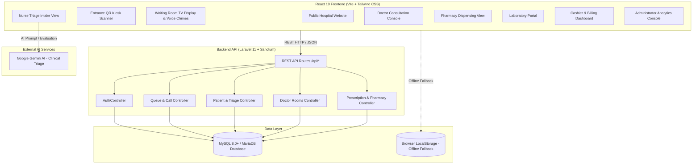
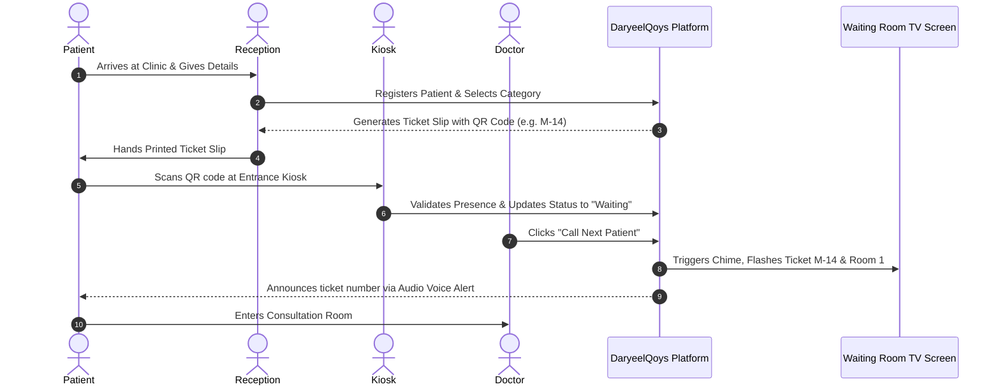

# DaryeelQoys — Clinic Triage & Smart Queue Management System

<div align="center">


**A Modern Hospital Queue Management, Emergency Maternal & Pediatric Triage, and Clinical Service Platform**

[](https://react.dev/)
[](https://tailwindcss.com/)
[](https://laravel.com/)
[](https://www.mysql.com/)
[](https://ai.google.dev/)
[](#dual-language--theme-customization)
[](LICENSE)

</div>

---

## 📌 Overview

**DaryeelQoys** is a full-featured clinical triage and smart queue management system engineered for modern healthcare facilities, community hospitals, and maternal-child health clinics. Designed for high-volume environments, it eliminates chaotic physical queues, accelerates emergency triage, coordinates care across multiple departments, and empowers patients with transparent digital queue tracking and QR-code-based ticketing.

The system features an offline-first **React 19 + Vite** frontend with built-in fallback, backed by an optional enterprise-grade **Laravel 11 & MySQL REST API**, alongside **Google Gemini AI** for clinical triage guidance.

---

## 🚀 Key Features & Modules

### 1. 🏥 Public Hospital Website & Portal
* Modern showcase for hospital services, specialties, facilities, and emergency hotlines.
* Real-time department hours, location information, and doctor profiles.
* Instant access to online ticket lookups, QR check-ins, and staff login.

### 2. 🎫 Smart Queue & Digital Ticketing
* Categorized ticket generation with priority routing:
  * **`M-xxx`**: Maternal & Antenatal Care (ANC)
  * **`P-xxx`**: Pediatrics & Child Health
  * **`G-xxx`**: General Outpatient (OPD)
  * **`E-xxx`**: Urgent & Emergency Cases
* Live wait-time estimator and queue position tracking.
* Printable official thermal ticket slips with QR codes generated on the fly.

### 3. 🚨 Emergency Maternal & Pediatric Triage (MCH)
* Rapid vitals entry: Blood Pressure (BP), Pulse Rate, Body Temperature, Respiratory Rate, Oxygen Saturation ($\text{SpO}_2$), and Fetal Heart Rate (FHR).
* Dynamic triage priority scoring:
  * 🔴 **P1 - Emergency (Degdeg)**: Immediate intervention required.
  * 🟡 **P2 - Urgent (Muhiim)**: Fast-track queue priority.
  * 🟢 **P3 - Standard (Caadi)**: Normal outpatient order.
* Integrated **Google Gemini AI** triage assistant for symptom risk assessment and clinical recommendations.

### 4. 🩺 Doctor Consultation Console
* Digital room console with "Call Next Patient" audio chime triggers.
* Comprehensive electronic medical records (EMR) review.
* Diagnosis documentation, clinical notes, and treatment planning.
* Electronic prescription (e-Rx) authoring sent directly to the hospital pharmacy.
* Laboratory diagnostic test orders sent straight to the lab.
* One-click generation of official stamped Medical Certificates and Discharge Summaries (PDF).

### 5. 📺 TV Waiting Room Display with Voice & Chime Alerts
* Full-screen dashboard designed for waiting hall TV monitors.
* Live queue status showing current serving ticket, department, and doctor room number.
* Multi-tone auditory chime and bilingual voice announcements (Somali & English) when patients are called.

### 6. 📱 Entrance Kiosk & QR Ticket Scanner
* Hardware/Webcam-based QR scanner for physical kiosks at clinic entrances.
* Instant check-in confirmation when patients scan their mobile or printed ticket.
* Automatic room navigation guidance for arriving patients.

### 7. 💊 Hospital Pharmacy & Inventory Management
* Queue of pending electronic prescriptions issued by attending doctors.
* Real-time inventory tracking: stock levels, batch numbers, dosage forms, and expiration warnings.
* Medication dispensing confirmation and printable pharmacy receipts.

### 8. 🔬 Diagnostic Laboratory Portal
* Digital order intake for lab investigations (CBC, Malaria smear, Blood Glucose, Urinalysis, etc.).
* Sample collection tracking, status workflows (Pending, In Progress, Completed).
* Result recording and automatic sync back to the doctor's consultation view.

### 9. 💳 Billing & Cashier Department
* Unified invoicing for registration fees, consultations, laboratory tests, and medications.
* Support for local Somali Mobile Money platforms (**EVC Plus**, **Zaad**, **Sahal**) and cash receipts.
* Official invoice generation and receipt printing.

### 10. 📊 Administrator Analytics & Clinic Management
* Live operational metrics: daily patient volume, average wait time, department loads, and completed consultations.
* Doctor-to-room assignment and real-time room availability toggling.
* System database synchronization status and audit logs.

### 11. 🌐 Dual-Language & Theme Customization
* Seamless one-click switching between **Somali (Af-Soomaali)** and **English**.
* Multiple medical color palettes (Sapphire Blue, Emerald Green, Royal Indigo, Medical Teal, Dark Mode).

---

## 🏗️ System Architecture



---

## 💻 Tech Stack

| Layer | Technology | Description |
| :--- | :--- | :--- |
| **Frontend Framework** | **React 19** | Modern reactive component architecture |
| **Language** | **TypeScript 5+** | Full static typing across models and views |
| **Build Tool** | **Vite 8** | High-performance development server and bundler |
| **Styling** | **Tailwind CSS v4** | Modern utility-first CSS design |
| **Icons** | **Lucide React** | Clean, accessible clinical iconography |
| **Documents / PDF** | **jsPDF** | Client-side generation of tickets, certificates & receipts |
| **QR Code Engine** | **qrcode** & **jsQR** | High-speed QR ticket rendering & camera scanning |
| **Audio Synthesis** | **Web Audio API** | Hospital chime synthesizer & voice queue announcements |
| **Artificial Intelligence** | **@google/genai** | Google Gemini API for automated triage recommendations |
| **Backend Framework** | **Laravel 11** | Robust PHP backend with Eloquent ORM |
| **API Authentication** | **Laravel Sanctum** | Secure token-based session management |
| **Database** | **MySQL 8.0+ / MariaDB** | Relational storage with foreign key constraints & indexes |

---

## 📂 Project Structure

```text
daryeelqoys_-clinic-triage-&-smart-queue/
├── backend-laravel/               # Laravel 11 Backend API
│   ├── app/
│   │   ├── Http/Controllers/Api/  # REST API Controllers (Auth, Queue, Patients, etc.)
│   │   └── Models/                # Eloquent Models (User, Patient, DoctorRoom, etc.)
│   ├── database/
│   │   ├── migrations/            # Laravel Database Migrations
│   │   ├── seeders/               # Pre-populated test and demo data
│   │   └── schema_mysql.sql       # Ready-to-import MySQL Database Dump
│   ├── routes/
│   │   └── api.php                # API route definitions
│   ├── .env.example               # Backend environment template
│   ├── composer.json              # PHP dependencies
│   └── README.md                  # Backend-specific setup guide
├── src/                           # React 19 Frontend
│   ├── components/                # UI Views and Modals
│   │   ├── dashboards/            # Role-specific portals (Doctor, Nurse, Admin, etc.)
│   │   ├── EntranceKioskScanner.tsx  # Camera-based QR ticket scanner
│   │   ├── DoctorConsoleView.tsx     # Doctor consultation and queue calling
│   │   ├── TriageIntakeView.tsx      # Vitals entry and AI triage assessment
│   │   ├── WaitingRoomDisplay.tsx    # Big-screen TV queue calling dashboard
│   │   ├── MaternalVaccineView.tsx   # Antenatal & immunization tracker
│   │   ├── PatientTicketLookup.tsx   # Public/Patient queue tracking
│   │   └── HospitalWebsite.tsx       # Public hospital homepage
│   ├── data/                      # Initial datasets & mock fallbacks
│   ├── services/                  # apiService.ts (REST connector with auto-reconnect)
│   ├── types/                     # TypeScript definitions (clinic.ts, index.ts)
│   ├── utils/                     # Audio announcements, QR tools, themes, PDF export
│   ├── App.tsx                    # Root application container & tab router
│   └── main.tsx                   # Application entry point
├── .env.example                   # Frontend environment template
├── package.json                   # Frontend npm scripts & dependencies
├── tsconfig.json                  # TypeScript configuration
├── vite.config.ts                 # Vite bundler configuration
└── README.md                      # Primary project documentation
```

---

## ⚙️ Installation & Setup

### Prerequisites

Ensure you have the following installed on your machine:
* **Node.js** (v18.0 or higher) and **npm** / **bun**
* **PHP** (>= 8.2) with extensions: `pdo_mysql`, `mbstring`, `openssl`, `curl`
* **Composer** (PHP dependency manager)
* **MySQL Server** (>= 8.0) or **MariaDB** (via XAMPP, Laragon, WAMP, or Docker)

---

### Step 1: Set Up the Frontend (React + Vite)

1. Open your terminal in the project root directory:
   ```bash
   cd daryeelqoys_-clinic-triage-&-smart-queue
   ```

2. Install dependencies:
   ```bash
   npm install
   ```

3. Configure environment variables:
   ```bash
   cp .env.example .env.local
   ```
   * *Optional:* Add your `GEMINI_API_KEY` in `.env.local` to enable Google Gemini AI clinical triage evaluations.

4. Start the frontend development server:
   ```bash
   npm run dev
   ```
   The application will be live at: **`http://localhost:3000`** (or the port indicated in your console).

---

### Step 2: Set Up the Backend (Laravel 11 & MySQL)

1. Open a new terminal and navigate to the backend directory:
   ```bash
   cd backend-laravel
   ```

2. Install PHP packages via Composer:
   ```bash
   composer install
   ```

3. Create the environment configuration file:
   ```bash
   cp .env.example .env
   php artisan key:generate
   ```

4. Create the MySQL Database:
   Open MySQL client or phpMyAdmin (`http://localhost/phpmyadmin`) and execute:
   ```sql
   CREATE DATABASE somali_hospital_db CHARACTER SET utf8mb4 COLLATE utf8mb4_unicode_ci;
   ```

5. Update database credentials in `backend-laravel/.env`:
   ```env
   DB_CONNECTION=mysql
   DB_HOST=127.0.0.1
   DB_PORT=3306
   DB_DATABASE=somali_hospital_db
   DB_USERNAME=root
   DB_PASSWORD=
   ```

6. Populate the database (choose **Option A** or **Option B**):

   * **Option A: Laravel Artisan Migrations & Seeders (Recommended)**:
     ```bash
     php artisan migrate --seed
     ```

   * **Option B: Direct SQL Import**:
     Import the included SQL schema file using your terminal:
     ```bash
     mysql -u root -p somali_hospital_db < database/schema_mysql.sql
     ```
     *(Or import `database/schema_mysql.sql` directly inside phpMyAdmin).*

7. Start the Laravel backend server:
   ```bash
   php artisan serve
   ```
   The backend API will start at: **`http://localhost:8000`**

---

### Step 3: Connect Frontend to Backend

1. When you launch the web application, click the **Laravel Backend** indicator or button in the navigation header.
2. Verify that the API URL is set to `http://localhost:8000/api`.
3. Click **"Test Connection"** to verify that the health check passes (`online: true`).
4. You can also click **"Sync All Local Records"** to migrate local demo data into your live MySQL database!

> **Note:** If the backend is not running, the application automatically operates in **Standalone / Offline Mode** using local browser storage, ensuring uninterrupted clinical workflows.

---

## 🔑 Demo User Accounts & Passwords

The system comes pre-seeded with sample user accounts for all hospital roles:

| Role | Name | Email | Password | Assigned Department / Room |
| :--- | :--- | :--- | :--- | :--- |
| **Admin** | Dr. Shire Axmed Maxamuud | `admin.shire@daryeelqoys.so` | `daryeel2026` | General Administration & Audit |
| **Doctor (OB/GYN)** | Dr. Maryan Xasan Faarax | `dr.maryan@daryeelqoys.so` | `daryeel2026` | Maternity / Room 1 |
| **Doctor (Pediatrics)** | Dr. Cabdiraxmaan Guuleed | `dr.guuleed@daryeelqoys.so` | `daryeel2026` | Pediatrics / Room 2 |
| **Doctor (Emergency)** | Dr. Sahra Cumar Cali | `dr.sahra@daryeelqoys.so` | `daryeel2026` | Emergency / Room 3 |
| **Triage Nurse** | Kalkaaliye Faadumo Jaamac | `nurse.faadumo@daryeelqoys.so` | `daryeel2026` | Emergency Triage Desk |
| **Receptionist** | Sahra Maxamed Nuur | `reception@daryeelqoys.so` | `daryeel2026` | Reception & Registration Desk |
| **Pharmacist** | Dr. Ibraahim Cabdi Cali | `pharmacy.ibrahim@daryeelqoys.so` | `daryeel2026` | Central Hospital Pharmacy |
| **Lab Scientist** | Khadar Maxamuud Nuur | `lab.khadar@daryeelqoys.so` | `daryeel2026` | Diagnostic Pathology Lab |
| **Cashier / Billing** | Fadxiya Cismaan Xirsi | `cashier.fadxiya@daryeelqoys.so` | `daryeel2026` | Billing & Mobile Money |
| **Patient** | Xaliimo Nuur Warsame | `xaliimo.nuur@gmail.com` | `daryeel2026` | Patient Portal (Ticket: `M-14`) |

*(Alternatively, the backend seeder accounts from `backend-laravel/README.md` such as `admin@somali-hospital.so` / `Admin123!` are also supported).*

---

## 🌐 API Endpoints Reference

| Method | Endpoint | Description |
| :--- | :--- | :--- |
| `GET` | `/api/health` | Server status and database connectivity check |
| `POST` | `/api/auth/login` | Staff / Patient authentication and Sanctum token generation |
| `GET` | `/api/queue/live-board` | Active queue state for the waiting room TV display |
| `GET` | `/api/patients` | Retrieve active patient list with triage levels and status |
| `POST` | `/api/patients` | Register new walk-in patient and issue queue ticket |
| `GET` | `/api/patients/lookup?q={ticket}` | Search ticket details by number or telephone |
| `POST` | `/api/kiosk/scan-qr` | Validate QR code scanned at entrance kiosk |
| `GET` | `/api/rooms` | Fetch list of consultation rooms and active doctor statuses |
| `POST` | `/api/queue/call-next` | Advance queue and broadcast audio chime call for next patient |
| `POST` | `/api/prescriptions` | Create e-prescription with medication items and dosage |
| `POST` | `/api/prescriptions/{id}/dispense` | Mark prescription as dispensed and decrement inventory |
| `GET` | `/api/pharmacy/inventory` | Retrieve pharmaceutical stock levels and alerts |

---

## 📱 QR Code Ticketing & Mobile Check-In Workflow



---

## 🧪 Testing & Code Quality

To verify the frontend TypeScript types and run static checks:
```bash
npm run lint
```

To create a production-optimized build of the client:
```bash
npm run build
```

To preview the built production bundle locally:
```bash
npm run preview
```

---

## 🛡️ Security & Privacy Notice
* **Medical Data Protection**: Patient records and triage observations should only be accessed by authorized clinical personnel.
* **Production Deployment**: When deploying to production, generate a strong `APP_KEY` in Laravel, enable HTTPS/SSL, restrict CORS domains in `config/cors.php`, and enforce strong database credentials.

---

## 📄 License

This project is licensed under the [MIT License](LICENSE). You are free to use, modify, and distribute this software for educational, clinical, and commercial healthcare applications.

<div align="center">
  <sub>Developed with ❤️ for community clinics, hospitals, and maternal-child healthcare centers.</sub>
</div>
